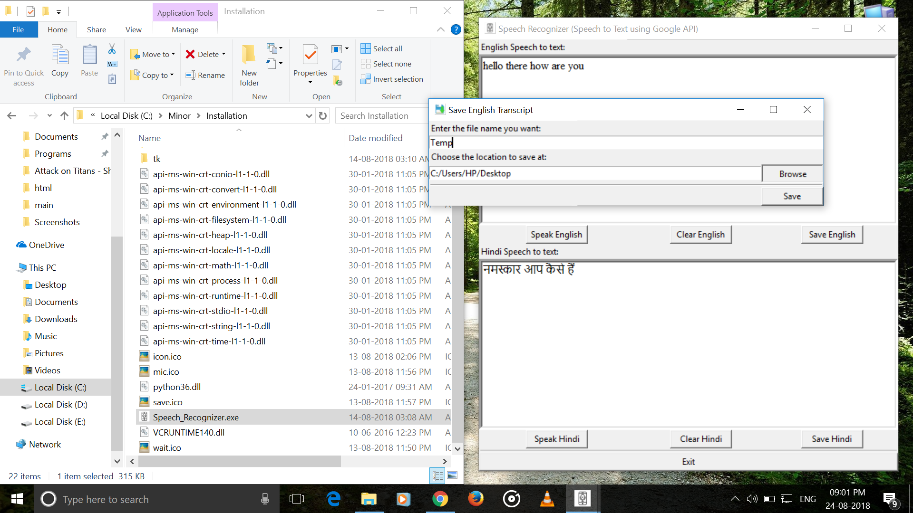

# Speech-Recognizer-cum-Voice-Typing-Editor
Speech Recognizer cum text editor that facilitates voice typing using Google Speech Recognition API.

## Downloading and Installing
Download the Windows installer here:

https://drive.google.com/open?id=1wlv4xfGBIw4wegSXGbfHPPKfWI9jHq92

Open the downloaded installer and follow the wizard to install the application at your desired location by specifying it when asked.

## Using
Follow the steps below for using - 
* From the folder in which the application was installed, open `Speech_Recognizer.exe`.

  

* Click on `Generate List` to dislay the list of Input and Output units of your PC. Enter the appropriate number corresponding to your microphone, which is generally named something like `Microphone Realtek....` or whatever company it is. After entering the correct number, click on `Submit`.

  

* This is the main window. Click on `Speak English/Hindi` to voice type English/Hindi respectively. Click on `Clear English/Hindi` to clear the contents of the box corresponding to English/Hindi respectively.

  

* You can click any of the boxes and edit their contents, like in a normal text editor at any point of time.

* To Save the content of any box click on the corresponding `Save English/Hindi` button. In the `Save Transcript` pop-up, click on `Browse` to select the desired folder to save in, enter the name of the new file you wanna save and click on `Save` to save the file.

  

* At any point of time, click on `Exit` to quit the application.
